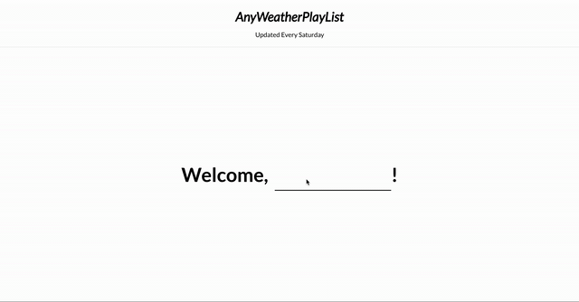

# ⛅ AnyWeatherPlaylist

wherever you are, this playlist would be perfect for today's weather!

당신이 어느곳에 있든, 오늘의 날씨에 맞는 soundcloud playlist를 재생시켜줍니다!

본 프로젝트는 사용자의 위치에 따라 날씨 / 온도 가져와 이에 알맞는 soundcloud playlist를 재생시켜 줍니다.

플레이리스트는 개발자의 지극히 개인적인 취향으로 구성되어있으며, 개발자가 날씨에 따라 자주듣는 플레이리스트로 구성되었습니다.

🌓 보통의 날: https://soundcloud.com/hyein-ju-65785883/sets/meh-day   
☀️ 해가 쨍쨍한 날: https://soundcloud.com/hyein-ju-65785883/sets/sunny-day   
☔ 비오는 날: https://soundcloud.com/hyein-ju-65785883/sets/rainy-day   
❄️ 눈오는 날: https://soundcloud.com/hyein-ju-65785883/sets/snowy-day   

⚠️ 사용자가 입력한 이름, 위치정보는 절대 저장되지 않으며 단순히 날씨에 맞는 플레이리스트를 보여주는데 사용되오니 걱정하지 않으셔도됩니다!

⚠️ 위치정보 사용을 거부하실 경우, 서울의 날씨를 가져오도록 설정되어 있습니다.

## 기능

- 날씨/시간/온도 보여주기
- 날씨에 따라 플레이리스트 재생

## 기술 스택

- Typescript
- React
- React-redux
- Redux-thunk
- styled-components
- include-media(responsive web)
- Google Geolocation API
- OpenWeatherMap API
